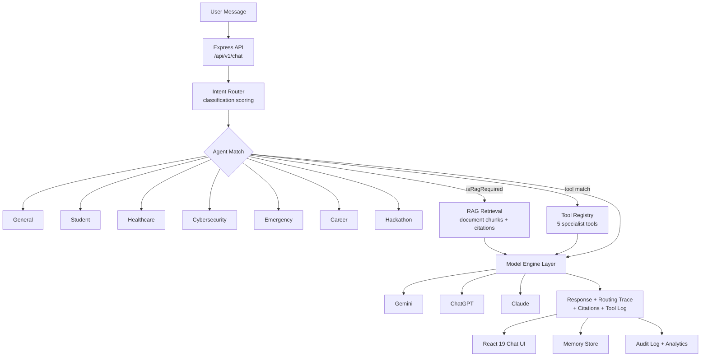

<div align="center">

# 🧠 GenAlpha AI

### Multi-Model Intelligent Agent Platform

**One prompt. Seven specialist agents. Three AI engines. The right expert, every time.**

[](https://gen-alpha-agent.vercel.app/)
[](https://vercel.com)
[](https://react.dev)
[](https://www.typescriptlang.org)
[](https://ai.google.dev)
[](LICENSE)

<br/>

### 🔗 [**⚡ LAUNCH THE LIVE PLATFORM ⚡**](https://gen-alpha-agent.vercel.app/)

**`https://gen-alpha-agent.vercel.app/`**

<br/>

[Overview](#-what-is-this) · [The Agent Roster](#-the-agent-roster) · [Key Features](#-core-capabilities) · [Architecture](#️-system-architecture) · [Tech Stack](#-tech-stack) · [API Reference](#-api-reference) · [Setup](#-getting-started) · [Deployment](#️-deployment) · [Roadmap](#️-roadmap)

</div>

---

## 🌐 What Is This?

A general-purpose chatbot is a jack of all trades — it can talk about anything, but it isn't *built* for anything. Ask it to reconstruct a fraud timeline, or build a personalized emergency evacuation plan, or map your resume against a job description, and you get competent generic advice instead of a purpose-built expert response.

**GenAlpha AI** takes a different approach. Every message first passes through an **intent-classification router** that scores it against seven specialist agent domains, picks the best match with a visible confidence score, and can invoke domain-specific tools before the model ever generates a reply. The result is a single chat interface that behaves like seven different specialists — with full transparency into *why* it routed the way it did.

<div align="center">

```
User Message
     │
     ▼
🧭 Intent Router  ──▶  confidence score · matched signals · classification breakdown
     │
     ├── ⚡ Fraud Analyzer          (Cybersecurity Agent)
     ├── 🎒 Emergency Planner       (Disaster Agent)
     ├── 📊 Skill-Gap Analyzer      (Career Agent)
     ├── 🏗️ Hackathon Architect     (Hackathon Agent)
     └── 📚 Study Roadmap Planner   (Student Agent)
     │
     ▼
Gemini / ChatGPT / Claude Engine  ──▶  Response + Citations + Tool Trace
```

</div>

---

## 🎭 The Agent Roster

Seven named agents, each with its own system role, capability set, and suggested prompts:

| Agent | Specialty |
|---|---|
| 🧩 **Genalpha Core** | Comprehensive reasoning, writing, coding, and general problem solving |
| 🎓 **College & Student Assistant** | Adaptive study schedules, exam prep, flashcards, conceptual mastery |
| 🏥 **Healthcare Information Assistant** | Medical terminology, health education, wellness guidance, visit prep |
| 🛡️ **Cybersecurity & Fraud Assistant** | Scam detection, phishing triage, URL inspection, fraud-journey reconstruction |
| 🚨 **Disaster & Emergency Assistant** | Evacuation protocols, crisis checklists, personalized household emergency plans |
| 💼 **Career & Job Assistant** | Resume audits, job-description skill-gap mapping, behavioral interview coaching |
| 🚀 **Hackathon & Project Assistant** | Idea-uniqueness checks, system architecture, MVP scoping, pitch-deck generation |

Auto-routing means the user never has to pick one manually — but every agent can also be **pinned** directly from the sidebar.

---

## ✨ Core Capabilities

### 🧭 Transparent Intent Routing
Every message returns a full `RoutingDecision` — the selected agent, a confidence score, matched keyword signals, per-agent classification scores, the runner-up agent, and processing time — so routing is auditable, not a black box.

### 🛠️ Domain-Specific Tool Execution
Five purpose-built tools activate automatically when relevant, each logged with input, output, execution time, and status:

| Tool | What it does |
|---|---|
| `fraud_analyzer` | Reconstructs a scam's timeline and flags manipulation tactics |
| `emergency_planner` | Builds a personalized household emergency and evacuation plan |
| `skill_gap_analyzer` | Maps a resume against a job description's required skills |
| `hackathon_architect` | Scopes an MVP and proposes a system architecture for a project idea |
| `study_roadmap_planner` | Generates an adaptive study schedule toward an exam or goal |

### 🔀 Multi-Model Engine Support
Built to route across **Gemini, ChatGPT, and Claude** engines, so a response can be generated by whichever model backs the active configuration — engine choice travels with every message and routing decision.

### 📚 RAG Document Search with Citations
Upload documents, have them chunked and indexed, and get answers grounded in your own files — every response carries citations with filename, chunk index, matched snippet, and relevance score.

### 🧠 Persistent User Memory
The assistant remembers facts across conversations — preferences, profile details, education, security, health, and career context — each memory tagged by category and traceable back to the message that created it.

### 💬 Full Conversation Management
Multi-conversation history with titles, pinned agents, live message counts, and last-message previews — so context never gets lost between sessions.

### 👍 Feedback & Audit Trail
Every response can be rated with an optional comment, and the system keeps a live **audit log** of routing decisions, tool calls, and system events for full operational transparency.

### 📊 Analytics Dashboard
Live system metrics — total requests, estimated token usage, average latency, per-agent activity counts, per-tool call counts, and feedback sentiment — surfaced directly in the UI.

### 🎙️ Voice Mode
Microphone-enabled voice interaction, with optional auto-playback of responses for a fully hands-free conversation.

---

## 🏗️ System Architecture



**Flow:** a message hits the router → the router scores it against all seven agents and decides if RAG or a tool is needed → the selected engine generates a response grounded in retrieved context and tool output → the reply returns with a full routing trace, citations, and tool execution log → memory, audit logs, and analytics update in real time.

---

## 🧰 Tech Stack

| Layer | Technology |
|---|---|
| **Frontend** | React 19, TypeScript, Vite 8, Tailwind CSS 4 |
| **UI / UX** | Lucide React icons, Motion (animations) |
| **Backend** | Node.js, Express 4, TypeScript (`tsx` / `esbuild`) |
| **AI Engines** | Google Gemini (`@google/genai`), with ChatGPT and Claude engine support |
| **Retrieval** | Custom RAG chunking, indexing, and citation scoring |
| **Voice** | Web Speech / microphone integration |
| **Deployment** | Vercel |

---

## 🚀 Getting Started

### Prerequisites
- **Node.js 18+**
- A **Google Gemini API key** — [get one here](https://aistudio.google.com/apikey)
- *(Optional)* OpenAI and/or Anthropic API keys for the ChatGPT and Claude engines

### Installation

```bash
# 1. Clone the repository
git clone https://github.com/sathi2305/GenAlpha-Agent.git
cd GenAlpha-Agent

# 2. Install dependencies
npm install

# 3. Configure environment
cp .env.example .env
# add your API keys to .env

# 4. Start the dev server
npm run dev
```

The app runs at **http://localhost:3000**

### Environment Variables

```env
GEMINI_API_KEY="your_gemini_api_key"
APP_URL="http://localhost:3000"

# Optional — enables additional model engines
OPENAI_API_KEY=
ANTHROPIC_API_KEY=
```

> 🔐 `.env` is gitignored — never commit API keys. Rotate immediately if one is ever exposed.

### Available Scripts

| Command | Description |
|---|---|
| `npm run dev` | Dev server with Vite middleware + HMR |
| `npm run build` | Build client (Vite) and bundle server (esbuild) |
| `npm start` | Run the production build |
| `npm run preview` | Preview the built client |
| `npm run lint` | Type-check with `tsc --noEmit` |
| `npm run clean` | Remove build artifacts |

---

## 🔌 API Reference

**Base URL:** `https://gen-alpha-agent.vercel.app/api/v1`

### Core
| Method | Endpoint | Description |
|---|---|---|
| `GET` | `/agents` | List all seven agents with capabilities and prompts |
| `POST` | `/chat` | Send a message — returns routed response, citations, and tool trace |
| `GET` | `/users` | User profile listing |

### Conversations
| Method | Endpoint | Description |
|---|---|---|
| `GET` | `/conversations` | List all conversations |
| `POST` | `/conversations` | Create a new conversation |
| `GET` | `/conversations/:id` | Fetch a conversation's full message history |
| `PATCH` | `/conversations/:id` | Update conversation title or pinned agent |
| `DELETE` | `/conversations/:id` | Delete a conversation |

### Memory & Documents
| Method | Endpoint | Description |
|---|---|---|
| `GET` | `/memory` | List stored user memories |
| `POST` | `/memory` | Save a new memory entry |
| `DELETE` | `/memory/:id` | Delete a memory entry |
| `GET` | `/documents` | List uploaded RAG documents |
| `POST` | `/documents` | Upload and chunk a document for RAG search |
| `DELETE` | `/documents/:id` | Delete a document |

### Tools, Feedback & Ops
| Method | Endpoint | Description |
|---|---|---|
| `POST` | `/tools/execute` | Directly invoke a specialist tool |
| `POST` | `/feedback` | Submit rating and comment for a response |
| `GET` | `/analytics` | System-wide usage and performance metrics |
| `GET` | `/audit-logs` | Recent routing and system audit log entries |

### System
| Method | Endpoint | Description |
|---|---|---|
| `GET` | `/health`, `/api/health` | Service health check |
| `GET` | `/ready` | Readiness probe |
| `GET` | `/version` | Build/version info |

---

## 🗂️ Project Structure

```
GenAlpha-Agent/
├── server.ts                          # Express bootstrap, static/Vite serving
├── vite.config.ts                     # Vite + React + Tailwind config
├── index.html                         # App shell
├── .env.example                       # Environment template
└── src/
    ├── main.tsx                       # React entry point
    ├── App.tsx                        # Root state & layout
    ├── types.ts                       # Agent, routing, memory, analytics types
    ├── server/
    │   ├── agents.ts                  # 7 agent definitions & system roles
    │   ├── orchestrator.ts            # Intent classification & routing logic
    │   ├── engines.ts                 # Multi-model engine abstraction
    │   ├── gemini.ts                  # Gemini API integration
    │   ├── rag.ts                     # Document chunking, indexing, citations
    │   ├── tools.ts                   # 5 specialist tool implementations
    │   └── store.ts                   # In-memory data store
    └── components/
        ├── Sidebar.tsx                 # Conversation list & agent pinning
        ├── WelcomeView.tsx             # Landing / empty-state view
        ├── ChatInput.tsx               # Message composer + voice input
        ├── MessageItem.tsx             # Message bubble, citations, tool trace
        ├── AgentSelector.tsx           # Manual agent picker
        ├── AgentsModal.tsx             # Full agent roster view
        ├── MemoryModal.tsx             # User memory management
        ├── DocumentsModal.tsx          # RAG document upload & management
        ├── FeedbackModal.tsx           # Response rating UI
        ├── AnalyticsModal.tsx          # Usage & performance dashboard
        └── SettingsModal.tsx           # User preferences & engine settings
```

---

## ☁️ Deployment

Deployed on **Vercel**.

| Setting | Value |
|---|---|
| **Framework Preset** | Vite |
| **Build Command** | `npm run build` |
| **Output Directory** | `dist` |
| **Environment Variables** | `GEMINI_API_KEY` (required, secret); `OPENAI_API_KEY`, `ANTHROPIC_API_KEY` (optional, secret) |

**Live URL:** https://gen-alpha-agent.vercel.app/

---

## 🗺️ Roadmap

- [ ] Persistent database replacing in-memory conversation/memory store
- [ ] Streaming token-by-token responses in the chat UI
- [ ] User authentication and per-user data isolation
- [ ] Expanded tool registry — web search, code execution, calendar integration
- [ ] Fine-grained per-agent model selection (route different agents to different engines)
- [ ] Exportable conversation transcripts
- [ ] Team/workspace mode for shared conversations and documents

---

## 🤝 Contributing

```bash
git checkout -b feature/your-feature-name
git commit -m "Add: clear description of your change"
git push origin feature/your-feature-name
# Open a Pull Request
```

Run `npm run lint` before submitting. When adding a new agent, define it in `src/server/agents.ts`, add its `AgentId` to `src/types.ts`, and extend the router in `src/server/orchestrator.ts`.

---

## 📄 License

Distributed under the MIT License. See [`LICENSE`](LICENSE) for details.

---

## 👤 Author

**Sathiyamoorthi**

[](https://github.com/sathi2305)

---

<div align="center">

### ⭐ If this project helps you, consider starring the repository.

**[🧠 Try the Live Platform](https://gen-alpha-agent.vercel.app/)**

*The right expert for every question — automatically.*

</div>
